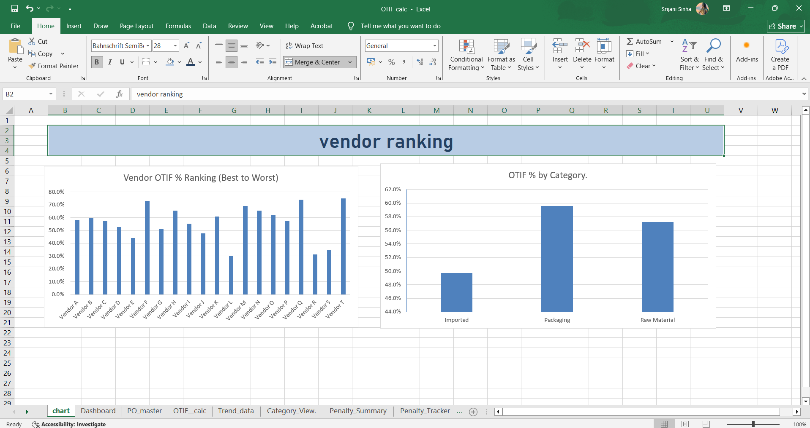

# Supply Chain OTIF & Vendor Scorecard MIS

An Excel-based Management Information System (MIS) that tracks vendor delivery
performance for a manufacturing/procurement supply chain — built end-to-end
from raw purchase order data to an executive dashboard.

**Tools used:** Microsoft Excel (formulas, PivotTables, PivotCharts, Slicers, Data Validation)

---

## 📌 Project Overview

Every time a company places a Purchase Order (PO) with a vendor, two things matter:
1. Did the vendor deliver **on time**?
2. Did the vendor deliver the **full quantity ordered**?

Together, these make up **OTIF (On-Time-In-Full)** — one of the most widely
used vendor performance metrics in supply chain and procurement teams.

This project simulates a real MIS workflow: raw delivery data comes in, gets
cleaned and validated, KPIs get calculated automatically with formulas, and
the results roll up into a one-page dashboard that a Procurement/Supply Chain
Head could actually use in a weekly review.

---

## 🗂️ Workbook Structure

| Sheet | What it does |
|---|---|
| `Raw_PO_GRN` | Raw, unedited PO + Goods Receipt Note data (source of truth) |
| `PO_master` | Cleaned master list — one row per purchase order |
| `OTIF_calc` | Calculates On-Time flag, In-Full flag, OTIF flag, Lead Time, Fill Rate %, Rejection Rate % |
| `Penalty_Tracker` | Adds a late-delivery penalty (₹500/day) for every delayed PO |
| `Category_View` | Pivot table — OTIF % broken down by product category |
| `Vendor_Scorecard` | Pivot table — OTIF % per vendor, ranked best → worst |
| `Penalty_Summary` | Pivot table — total penalty ₹ and average delay per vendor |
| `Dashboard` | KPI cards + slicers for a one-page executive summary |
| `Charts` | Detailed PivotCharts: vendor ranking, category comparison, penalty leaderboard, monthly trend |
| `Process_Notes` | Business rules, refresh steps, and a ready-to-send weekly email template |

---

## 📐 Business Rules

- **On-Time** = Received Date ≤ Promised Date
- **In-Full** = Received Qty ≥ Ordered Qty × 98% *(98% tolerance is a standard industry buffer)*
- **OTIF** = "Yes" only if **both** On-Time and In-Full are "Yes"
- **Penalty** = Delay Days × ₹500/day (simplified late-delivery clause)
- Pending POs are excluded from OTIF/Fill Rate calculations until marked "Delivered"

---

## 📊 Key Insights (from sample dataset)

- **Overall OTIF: 56.6%** — well below the 90%+ benchmark typical for a healthy supply chain
- **Average Fill Rate: 97.3%** — quantity shortfalls are a smaller issue than lateness
- **Average Lead Time: 10 days**
- **Total penalty exposure: ₹6,47,000** across the review period
- Vendors performing below 40% OTIF are flagged for escalation to the Procurement Head (see `Process_Notes`)

---

## 🖼️ Dashboard Preview

*(Add screenshots here — see instructions below)*

---

## 🔁 How to Refresh with New Data

1. Paste new PO + GRN rows into `Raw_PO_GRN`
2. Copy the same rows into `PO_master`
3. Drag formulas down in `OTIF_calc` and `Penalty_Tracker` to cover new rows
4. Right-click each PivotTable → **Refresh**
5. Dashboard and Charts update automatically

Full details in the `Process_Notes` tab inside the workbook.

---

## 🧠 What I Learned

- Building multi-layer Excel formulas (nested IF logic for OTIF flags)
- PivotTables, PivotCharts, and connecting Slicers across multiple pivots
- Structuring a workbook the way a real MIS/reporting analyst would — separating raw data, calculations, and presentation layers
- Debugging: caught and fixed two logic errors (an averaged single-cell reference and a SUM/AVERAGE mix-up) before finalizing the KPI cards

---

## 📁 Files in this Repo

- `OTIF_Vendor_Scorecard_MIS.xlsx` — the full workbook
- `screenshots/` — dashboard and chart images
- `README.md` — this file
